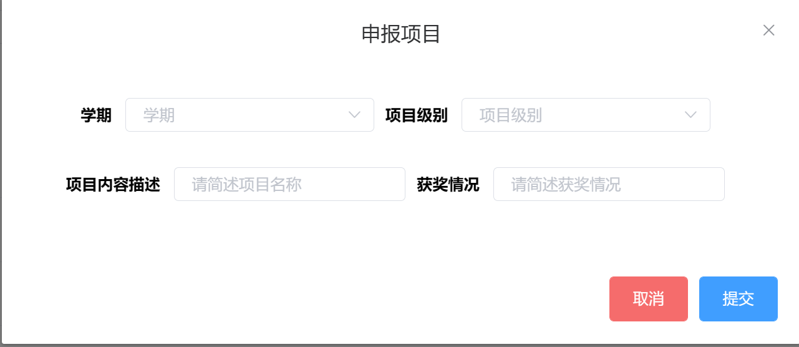
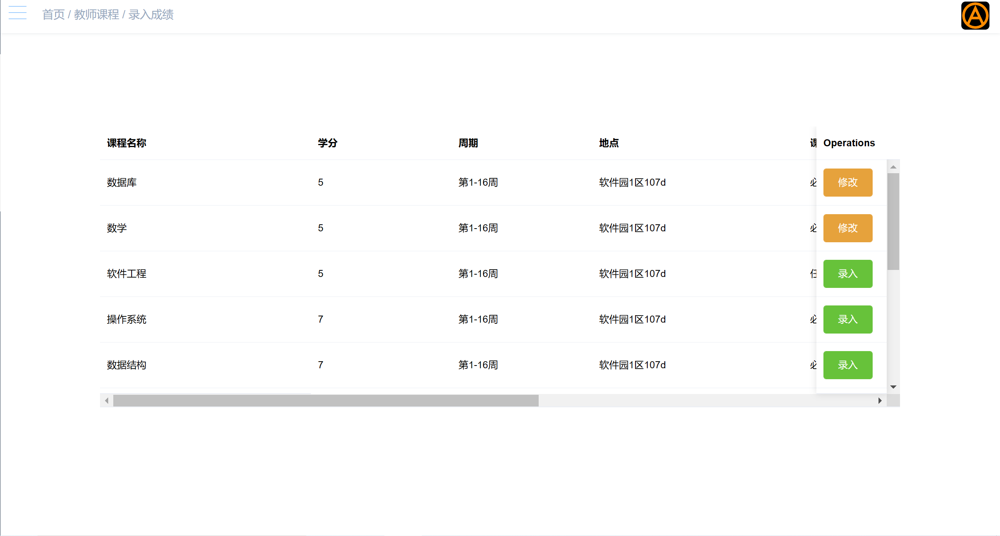

### 山东大学软件学院web技术课程实验报告
#### 组号:  223
#### 班级： 工业软件菁英班
#### 实验学时：16
#### 实验日期： 2022年9月1日至2022年12月31日
#### 实验目的：
####    熟练掌握和灵活应用网站的规划设计方面的理论知识和技能，规划和设计两个网站，使设计的网站能够对网页布局有充分的掌控能力，合理的选择颜色、字体、分辨率以及图片、声音、动画等多媒体元素，能最终实现网站的前端设计目标。
####    熟练掌握和灵活应用后端技术，使用servlet或者jsp实现与前端的数据交互，实现对数据库的访问。
#### 硬件环境：MacBookPro16,3 8核8GB内存

#### 软件环境： 
    1.操作系统:win10家庭版
    2.开发工具:IDEA,VSCode,OpenJdk-17,Node.js
    3.数据库：SQLite
    4.数据设计:DB Browser For SQLite
    5.应用服务与web服务:SpringBoot web(spring-boot-starter-web)
#### 输出成果:
    1.文档
        1.1 23_实验报告.md
        1.2 markdownImg(实验报告依赖的图片库)
        1.3 javadoc(接口文档，IDEA自动生成的)
        1.4 ER关系图
        1.5 init.sql（但是请不要直接执行这个脚本，请复制里面的sql语句到DBBrowserForSQLite中执行）
    2.202100300063_李彦浩_实验1.zip
        2.1 java-client-expend.zip(前端源码)
        2.2 java-server.zip(后端源码)
        2.3 teach-1.0-SNAPSHOT.jar(maven构建生成jar包)
        2.4 dist.zip(前端项目包)
        2.5 icon.zip(前端项目依赖的字体图标库)
        *:sql文件方面,本项目使用jpa技术自动根据实体类建表,因此没有建表的脚本
        但是项目有初始化的脚本代码，详情见下方的部署模块。
#### 贡献权重占比
根据每个人的工作量，决定权重占比如下(总权重为人数，3):
李彦浩(202100300063):1.25
李世会(202100300078):0.875
马亿祥(202100300061):0.875

#### 项目说明:
项目客户为山东大学软件学院，工期为120天，计划投入2人天/工时，项目组共有3人，分工如下:
    1. 李彦浩(202100300063)：负责前端
    2. 李彦浩(202100300063)：负责后端开发
    3. 李彦浩(202100300063)：负责数据设计
    4. 李世会(202100300078)：负责数据设计
#### (一) 需求分析:
系统需要包括:
学生基本信息维护，学生选课，学生成绩查看，学生社会成果维护，学生个人主页，学生个人信息统计
教师基本信息维护，教师开设课程，教师导入/修改成绩，教师提交成绩，教师研究方向及论文著作展示
管理员基本信息维护，管理员导入人员名单，管理员设置选课起始时间
系统应能支持100000（十万）总用户量，最高支持100000/8=1250QPS，时间片1ms，页面最长响应时间100s
####（二）概要设计
分为:
用户管理、学籍管理、课程管理、系统配置、个人主页维护模块。
用户分为管理员、教师、学生三个角色
功能简述如下:
1.用户管理:
支持三种用户角色(管理员、学生、教师)。
支持用户注册登录。支持不同角色的不同路由。
支持以邮件形式找回密码与密码重置功能(验证码实现防刷机制)。
2.前端展示：
支持伸缩式二级导航栏，内含系统logo。
支持头部面包屑定位以及个人头像展示。
支持实时信息提示。
支持不同功能模块分区布局。
3.基本信息维护：
支持修改用户名、密码、邮箱、手机号等身份验证信息，且修改后不影响当前会话。
支持上传并存储、展示头像。
支持密码长度校验。
4.课程中心：
支持教师角色个性化申报、编辑课程。
支持学生角色在选课期间进行选、退课，且进行自动冲突检测(时间、人数)。
支持对课程的简单搜索引擎。支持学生、教师角色的个性化定制可视课表。支持管理员设置选课起止时间。
支持教师角色在选课角色后一键生成并下载excel点名册。
支持教师角色以excel表格的形式批量导入课程成绩，且有修改功能。
支持教师录入成绩后学生角色在成绩查询页面进行成绩的条件查询(允许空条件)。
支持计算、显示学生在指定学期/学年的平均学分绩点，
支持计算学生的总平均学分绩点，
支持比较各学生GPA并进行班级、专业内的排名。
5.学工管理：
支持学生角色申报社会实践/课外活动/成果奖励，并支持服务器本地存储学生角色上传的资料与数据回显。
支持学生角色间的互评，可按已有标签或自由添加标签提交互评。
支持学生角色接收新互评消息的提醒。
支持学生角色查看自己获得的互评。
支持学生查看最近TA给出的互评和收到的互评。
支持学生查看自己得到的互评标签的统计排名。
支持学生之间的简单搜索引擎(条件查询)。
6.学生主页：
	支持学生点击头部导航栏头像或点击伸缩导航栏快捷进入学生主页。
	支持学生通过表单的形式快捷修改个人信息与照片(头像)。
支持学生修改自身用户信息后保持当前会话。
支持学生查看博客目录（博客字典）。
支持博客间路由导航。
支持历史博客(其他博客)功能。
支持博客编辑与删除。
支持学生角色的词云统计(Word Cloud Statistic)。根据学业、社会实践、特长、互评标签进行词云统计，同时给出图形化数据统计界面。
7.教师主页：
	支持教师角色通过导航栏或头像快速进入主页，并进行信息的编辑修改。
	支持教师角色在个人主页更新其照片、研究方向、论文著作。（含新增、修改、删除）
	支持教师角色查看其讲授课程的个性化可视课表。
8.项目质量：
	表单具有输入校验，对格式、内容进行检查。
	系统运行稳定，异常不崩溃，不会无理由退出或显示4xx/5xx错误
	会话管理正确，在授权的前提下修改信息不会影响会话。
	防刷机制(验证码，噪音，干扰)
	代码风格良好，有命名规范，有注释规范，有编码规范。
	对一些常见web风险有防范，如sql注入。
9.数据设计
	数据字段命名规范，设计合理。
	含人员、用户、学生、教师、管理员、课程、选课、成绩、互评、活动实践、博客等表。约束健全，关系完备。
#### （三）系统架构
系统采用前后端分离的架构，前端使用Vue3,Element-Plus UI。使用node打包。
后端使用SpringBoot框架，优点是:
集成了大量常用的第三方库的配置， Spring Boot 应用为这些第三方库提供了几乎可以零配置的开箱即用的能力
。使用JavaConfig有助于避免使用XML。
避免大量的Maven导入和各种版本冲突。
没有单独的Web服务器需要。不再需要启动Tomcat，Glassfish或其他任何东西。
需要更少的配置因为没有web.xml文件。只需添加用 Configuration注释的类，然后添加用 Bean注释的方法，Spring将自动加载对象并像以前一样对其进行管理。
可以将 Autowired添加到bean方法中，以使Spring自动装入需要的依赖关系中。
目标用户环境为Edge\FireFox\Chrome浏览器(Edge102版本以上，FireFox68.4版本以上，Chrome102版本以上),
建议分辨率1280×800。
#### （四）数据设计
ER关系图如下


#### 用户表:
包括以下字段:
1.主键id（唯一，非空）
2.用户名(账号)（唯一，非空）
3.密码(MD5加密)（非空，长度检查）
4.用户类型(管理员、学生、教师)（非空，与用户类型UserType表有外键约束，参见UserType表ID字段）

#### （五）功能接口
##### 用户登录
功能：对账号，口令进行认证，成功跳转角色对应页面，失败则提示错误原因
地址：/api/auth/login
调用参数:LoginRequest(登录请求，含用户名密码)
返回参数:ResponseEntity(响应实体，含有token，用户名，用户ID，用户角色类型)

##### 用户注册
功能：跟据提供的excel表格，实现对人员的数据库批量录入
地址:/api/info/uploadPerson
调用参数:MultiPartFile(excel的xlsx文件)
返回参数:DataResponse(响应导入成功还是失败，若失败显示原因)

##### 用户重置密码
功能：根据提供的账号（同时也是唯一标识之一），向人员绑定的邮箱发送邮件，内含暂行密码
地址:/api/auth/sendEmail
调用参数:DataRequest(内含用户名和验证码)
返回参数:DataResponse(响应是否已发送邮件，若发送失败则显示失败原因:验证码错误/没有绑定邮箱)

##### 生成验证码
功能：生成验证码，防止根据账号绑定向指定邮箱恶意大量发送重置密码邮件
地址：/api/auth/generateCheckCode
调用参数:HttpServletRequest，HttpServletResponse（响应输出流写回二维码图片）
返回参数：无

##### 生成词云
功能：根据学生用户的账号信息，根据学业、社会实践成果、互评结果生成词云
地址：/api/info/generateWordCloud
调用参数：无
返回参数:DataResponse(响应生成结果：成功/失败，如失败，返回失败原因信息)

##### 个人信息统计
功能: 根据学生用户的账号信息，根据学业、社会实践成果、互评结果生成具体数据统计
地址:/api/info/generateStatistics
调用参数：无
返回参数：DataResponse(响应生成结果：成功/失败，如失败，返回失败原因信息)

##### 获取用户头像
功能：根据登进的用户获取其最新上传的头像
地址:/api/info/getPersonImage
调用参数:无
返回参数:DataResponse(响应图片的Base64编码的字符串)

##### 互评新消息提醒
功能：提示用户是否收到新的（未查看过的）互评消息
地址：/api/assessment/showUnChecked
调用参数：无
返回参数：DataResponse(响应新消息的数量)

##### 获取个人基本信息
功能：获取用户的基本信息
地址：/api/info/showPerson
调用参数：无
返回参数：DataResponse(含用户ID，邮箱，手机，姓名，学工号，专业，生日，性别，年龄，用户类型，用户名，密码（密文）)

##### 编辑个人基本信息
功能：用户表单编辑并提交上述基本信息，同步至数据库
地址：/api/info/infoEdit
调用参数:DataRequest(含上述除用户ID外的基本信息)
返回参数：DataResponse(响应是否修改成功，如失败响应失败原因)

##### 更换Token
功能：用户修改用户名后，原先的token是按照旧用户名生成的，那么用户此时就丢失了权限，需要根据新的用户名重新签发token至前端
地址：/api/info/changeToken
调用参数:LoginRequest(相当于又登录了一次，只不过这次是系统帮忙做的，含用户名（新）、密码)
返回参数：ResponseEntity(新的token，新的用户名)

##### 展示社会实践成果
功能：展示当前学生用户的社会实践成果
地址：/api/studentManagement/showPractice
调用参数：无
返回参数：DataResponse(含社会实践成果的具体信息)

##### 生成查询选项
功能：根据该学生的年级，生成先前所有年级的查询选项（例如，某学生大四，那么TA可能大一到大四都参与过社会实践，如果TA想根据年级和学期来查询过自己的社会实践成果，我们就要生成大一到大四的查询选项供TA选择）
地址：/api/score/generateElOption
调用参数：无
返回参数：DataResponse(响应所有的学期选项)

##### 社会实践查询
功能：条件查询（同时也是模糊查询）某学生的所有社会实践成果
地址：/api/studentManagement/practiceQuery
调用参数：DataRequest(含所有条件：学期，项目级别，审核状态，日期)
返回参数：DataResponse(所有满足条件的社会实践成果)

##### 社会实践申报
功能：学生提供材料，申报社会实践项目
地址：/api/studentManagement/addPractice
调用参数：DataRequest(含社会实践项目的基本信息，如项目级别，日期，获奖情况，学期等)
返回参数：DataResponse(响应申报是否成功)

##### 社会实践材料上传
功能：学生根据自己申报的社会实践项目，上传相应的材料
地址：/api/studentManagement/uploadProof
调用参数：Map(params)/MultiPartFile(含材料以及申报项目的ID)
返回参数：DataResponse(响应上传材料是否成功)

##### 获取当前博主
功能：根据登进的学生用户获取当前博主信息
地址：/api/blog/getBlogger
调用参数：无
返回参数：DataResponse(响应当前博主个人信息：用户名、博客数量、个人简介)

##### 获取用户博客
功能：根据登进的学生用户获取当前用户的所有博客
地址：/api/blog/getBlogs
调用参数：无
返回参数：DataResponse(响应当前用户的所有博客信息：标题、简介、发布日期)

##### 获取博客ID
功能：页面跳转用，先抓取当前选中博客的ID，保存，以便将页面跳转到对应ID的博客
地址：/api/blog/fetchBlogId
调用参数：DataRequest(内含博客ID)
返回参数：DataResponse(响应抓取ID是否成功)

##### 添加博客
功能：用户编辑提交博客
地址：/api/blog/addBlog
调用参数：无
返回参数：DataResponse(响应添加博客是否成功)

##### 展示博客内容
功能：展示用户某一博客的正文内容
地址：/api/blog/showBlog
调用参数：无
返回参数：DataResponse(响应博客正文内容)

##### 展示用户其他博客目录
功能：用目录的形式展示用户的其他博客（无正文内容，点击跳转）
地址：/api/blog/showOther
调用参数：无
返回参数：DataResponse(响应用户的其他博客目录)

##### 删除博客
功能：删除用户指定博客
地址：/api/blog/deleteBlog
调用参数：DataRequest(当前待删除博客的ID)
返回参数:DataResponse(响应是否删除成功)

##### 展示互评统计结果
功能：根据互评词频，生成统计结果（走马灯形式）
地址：/api/assessment/showWordCloud
调用参数：无
返回参数：DataResponse(响应排名前三的互评及其评价者)

##### 互评展示
功能：展示该学生用户的所有互评
地址：/api/assessment/showAssessment
调用参数：无
返回参数：DataResponse(响应该学生用户所有互评)

##### 更新互评查看状态
功能： 更新学生互评的查看状态
地址：/api/assessment/changeChecked
调用参数：无
返回参数：DataResponse(响应更新结果)

##### 查看最近评价我的人
功能：展示最近评价该学生用户的其他学生用户
地址：/api/assessment/showRecentDeliver
调用参数：无
返回参数：DataResponse(响应最近评价该学生用户的其他学生用户)

##### 查看最近我评价的人
功能：展示最近该学生用户评价过的其他学生用户
地址：/api/assessment/showRecentReceive
调用参数：无
返回参数：DataResponse(响应最近该学生用户评价过的其他学生用户)

##### 查询学生用户
功能：条件模糊查询学生用户（以便给他发互评）
地址：/api/assessment/searchStudent
调用参数：DataRequest(内含该学生用户的姓名/学工号)
返回参数：DataResponse(响应满足条件的学生用户)

##### 发送互评
功能：向指定学生发送互评
地址：/api/assessment/addAssessment
调用参数：DataRequest(内含指定学生的ID，以及互评内容)
返回参数：DataResponse(响应互评是否发送成功)

##### 展示课程表
功能：展示当前学生用户的课程表
地址：/api/course/showCourse
调用参数：无
返回参数：DataResponse(响应当前学生用户课程列表)

##### 计算当前学分
功能：计算当前学生用户本学期已选学分
地址：/api/course/computeCredit
调用参数：无
返回参数：DataResponse(响应该学生本学期已选学分)

##### 展示可选课程
功能：展示当前学生可选课程（考虑冲突）
地址：/api/course/showSelectList
调用参数：无
返回参数：DataResponse(响应可选课程列表)

##### 学生选课
功能：学生选择指定课程
地址：/api/course/chooseCourse
调用参数：DataRequest（含课程ID）
返回参数：DataResponse(响应选课是否成功）

##### 学生退选
功能：学生退选指定课程
地址：/api/course/rejectCourse
调用参数：DataRequest(含课程ID)
返回参数：DataResponse(响应退选是否成功)

##### 课程查询
功能：条件模糊查询课程
地址：/api/course/courseQuery
调用参数：DataRequest（内含课程名、学分、教师名、课程性质）
返回参数：DataResponse(响应所有满足的课程)

##### 获取选课状态
功能：根据管理员设置的选课起始日期获取选课状态
地址：/api/course/checkIsOpen
调用参数：无
返回参数：DataResponse(响应选课状态)

##### 展示成绩
功能：展示当前学生这学期的成绩
地址：/api/score/showScore
调用参数：无
返回参数：DataResponse(响应这学期成绩)

##### 成绩查询
功能：根据条件模糊查询当前学生用户的成绩
地址：/api/score/scoreQuery
调用参数：DataRequest(含开课学期、课程名称)
返回参数：DataResponse（响应满足条件的成绩）

##### 计算平均绩点
功能：根据指定学期计算该学期当前学生的平均学分绩点
地址：/api/score/computeAverageGPA
调用参数：DataRequest(含开课学期)
返回参数：DataResponse(响应该学期该学生的平均学分绩点)

##### 获取教师信息
功能：根据登进用户获取对应教师的信息
地址：/api/blog/getTeacher
调用参数：无
返回参数：DataResponse(响应当前教师用户名)

##### 获取教师研究方向
功能：获取当前登进教师研究方向
地址：/api/blog/getResearch
调用参数：无
返回参数：DataResponse(响应当前教师研究方向)

##### 获取教师论文著作
功能：获取当前登进教师论文著作
地址：/api/blog/getPaper
调用参数：无
返回参数：DataResponse(响应当前教师论文著作)

##### 添加研究方向
功能：当前教师用户添加研究方向
地址：/api/blog/addResearch
调用参数：DataRequest（含新增研究方向）
返回参数：DataResponse(响应添加是否成功)

##### 添加论文著作
功能：当前教师用户添加论文著作
地址：/api/blog/addPaper
调用参数：DataRequest（含新增论文著作）
返回参数：DataResponse(响应添加是否成功)

##### 删除研究方向
功能：当前教师用户删除指定研究方向
地址：/api/blog/deleteResearch
调用参数：DataRequest(含指定待删除研究方向)
返回参数：DataResponse(响应删除是否成功)

##### 删除论文著作
功能：当前教师用户删除指定研究方向
地址：/api/blog/deletePaper
调用参数：DataRequest(含指定待删除论文著作)
返回参数：DataResponse(响应删除是否成功)

##### 展示教师开设课程
功能：展示当前教师用户开设课程
地址：/api/course/showTeacherCourse
调用参数：无
返回参数：DataResponse(响应当前教师用户开设课程)

##### 展示简易教师课程表
功能：教师开设课程时，为了方便教师预览已开设课程和空闲时间（可以开设课程的时间），生成简易课程表供教师选择开课时间
地址：/api/course/getSimpleTeacherCourse
调用参数：无
返回参数：DataResponse(响应当前教师用户当前学期开设课程列表)

##### 添加课程
功能：教师开设课程
地址：/api/course/addCourse
调用参数：DataRequest(含课程名，学分，地点，课程性质，课程周期（从第几周上到第几周），面向年级，课程人数上限，上课时间)
返回参数：DataResponse(响应添加是否成功)

##### 删除课程
功能：教师撤回已开设的课程
地址：/api/course/deleteCourse
调用参数：DataRequest（含待删除课程id）
返回参数：DataResponse(响应删除是否成功)

##### 选课结束导出名单
功能：选课结束，教师可以一键导出选择其指定课程的学生名单
地址：/api/course/downloadExcel
调用参数：HttpServletRequest,HttpServletResponse(文件输出流写回excel的xslx文件)
返回参数：无

##### 课程材料上传
功能:教师开设课程同时上传课程材料供审批
地址：/api/course/updateCourseZip
调用参数：Map(params)(含课程id),MultiPartFile（zip文件）
返回参数：DataResponse(响应上传文件是否成功)

##### 展示教师开设课程对应成绩单
功能：展示教师开设课程对应成绩列表
地址：/api/score/showTeacherScore
调用参数：无
返回参数：DataResponse(响应教师开设课程列表)

##### 教师excel表格批量导入提交学生成绩
功能：教师角色提交excel表格批量导入提交（更改）学生成绩
地址：/api/score/uploadScoreExcel
调用参数：Map（params)（内含是否为更改选项，课程ID），MultiPartFile(excel的xlsx文件)
返回参数：DataResponse(响应录入是否成功)

##### 管理员角色excel批量导入人员名单
功能：管理员角色excel批量导入人员名单
地址：/api/info/uploadPerson
调用参数：MultiPartFile(excel的xlsx文件)
返回参数：DataResponse(响应导入是否成功)

##### 管理员角色设置选课起始时间
功能：管理员角色设置选课起始时间
地址：/api/course/openCourse
调用参数：DataRequest(内含起始时间)
返回参数：DataResponse(响应设置起始时间是否成功)

#### （六）界面说明
1.登录界面

    输入用户名密码，点击登录捏按钮，成功跳转对应角色类型的页面，失败则提示用户名或密码错误
2.重置密码

    输入用户名和验证码，如果先前绑定过邮箱，则向绑定的邮箱发送邮件，内含一个8位暂行密码（含大小写字母，数字）

    若未绑定过邮箱，或验证码错误，则做出相应提示
3.学生首页

    内含根据学业、社会实践、互评生成的词云，以及对应的具体数据统计和平均学分绩点排名

    如果收到了新的互评，头部导航栏会出现一个提示的图标，点击该图标会跳出对话框，提示收到了x条新互评
4.学生基本信息页

    内含学生用户的基本信息与头像，可以点击圆框进行头像上传，在右侧的表单可以修改编辑信息，点击提交同步至数据库（用户名有唯一限制，密码有6到12位长度限制，邮箱有格式限制，手机号有长度限制）
5.学生社会实践管理

    内含学生所有的社会实践成果，可以通过状态栏进行条件模糊查询。


    点击申报项目可以填写表单申报已经完成的项目，随后在表格中上传凭证资料待审批。
6.学生博客

内含博主信息以及个人简介，另有博客目录，可以通过点击导航到博客正文。

点击右上角编辑图标可以展开表单编辑新的博客

博客正文含博客标题、简介、以及正文，点击标题旁的删除图标可以删除这篇博客。点击“他的其他博客”目录中的博客题目可以跳转至对应的博客
7.学生互评

学生互评页面内含5个模块。左侧可以输入某学生用户的姓名或学工号搜索该学生，并为其提供互评。另有最近评价过我的和最近我评价过的模块，快速找到互动度较高的用户，实现快捷互评。
右侧有互评消息展示，如果之前未查看过，右侧会有一个新消息的图标提示。
另外有互评词频统计，排名前三的互评会登上幻灯片榜单循环播放，还会提示有多少用户这样评价了当前用户，以便用户快速定位其他用户对自己的印象

点击加号会跳出表单。表单以选择标签的形式提交。标签有默认的标签与自定义的标签。点击“+点我新增”可以自定义表单标签。点击右下角重置可以重置标签，重新选择。

8.学生课程表

学生选课后会自动生成课程表。另外课程性质会以不同颜色呈现。红色是必修课，青色是任选课，紫蓝色是限选课
9.学生选课

在允许选课期间，学生可以进入选课界面进行选课。通过状态栏进行模糊查询。点击选课或退选做相应操作。一个学生用户只能看到与已选课程不冲突，且有剩余容量的面向其年级开设的课程，任何一个条件不满足都会导致该课程不显示。学生选课/退选后会重新计算这些条件。
另外有已选学分进度条，按照山东大学的选课规则，一学期选择的学分不能超过35.0，这里做出进度条进行提示。如果学分要超过35，则禁止选课。

如果超过了选课时间，则跳出提示消息，关闭选课通道
10.学生成绩查询

学生可以前往成绩查询页面查看成绩。可通过状态栏条件模糊查询自己的成绩。系统会自动计算平均分、排名、最高分并展示。

如果是通过开课学期进行成绩查询，还会显示该学期的平均学分绩点。
11.教师个人信息维护

教师基本信息和学生基本信息页面基本一致，不加赘述
12.教师研究方向与论文著作

展示教师研究方向与论文著作，可以点击右上角编辑按钮，会跳出输入框，输入回车即可提交新的研究方向或论文著作。点击对应研究方向/论文著作右侧的删除按钮可以一键删除这一项。
13.教师开设课程

首先会展示所有已经申报过的课程，点击绿色的申报的按钮可以提交课程材料(zip压缩包)，点击撤回可以撤回这门开课。

点击右上角的黄色新增按钮可以跳出申报课程的表单，每一项都是必填项。

另外附上简易的课程表，教师可以查看自己什么时间有空闲，可以开设课程，直接点击课程表中的空白单元格可以选中该单元格。如果是已经有课的单元格是无法选中的，会跳出错误提示。


选课结束，申报和撤回按钮会改为名单按钮，点击这个名单按钮可以下载一个excel表格，内容是选课学生名单
14.教师批量录入成绩

展示该教师所有开设的课程，可以点击右侧的修改或录入按钮上传一份excel的xlsx文件（按指定格式填写），随后即可批量录入成绩
15.教师课程表

教师课程表，与学生的基本一致，不加赘述
16.管理员人员录入

管理员可以一键导入excel的xlsx文件，进行人员录入
17.管理员设置选课起始时间

管理员可以一键设置选课起始时间，精确到秒

#### （七）安全设计
    1.sql注入：为了防止sql注入，采用参数化查询方式
```
@Query(value="select s from Student s where s.studentNum=?1 and s.studentName=?2")
    Student findStudentByStudentNumAndStudentName(String studentNum,String studentName);
//此处为jpql语句
```
    2.为防止恶意诱使系统发送邮箱，使用了验证码方法保护。（详情见界面说明中的重置密码部分）
    3.使用MD5算法对token中的Header进行加密，使用HS512签名加密对整个字符串进行加盐
    4.vue跨域请求配置
```
module.exports = {
  publicPath: './',
  devServer: {
    hot: true,
    disableHostCheck: true,
    https: false,
    proxy: {
      '^/api':
      {
        target: 'http://localhost:9090',
        changeOrigin: true
      },

    },
  },
  //outputDir: 'E:\\NewTeachFrame\\java-client\\dist',
  //  outputDir: 'C:\\teach\\web\\java-server\\src\\main\\resources\\public'
  outputDir:'C:\\web\\java-client-expend\\dist'
}   
```
outputDir为打包路径，代理路径为/api，目标服务器与端口为127.0.0.1:9090，不使用ssh协议。changeOrigin完成跨域

#### (八)部署说明
作为一个门户类内部网站，按照十万用户量估算，8台服务器，4核8GB内存，150G硬盘，带宽5MB。初始存储150GB，预估每年扩容100GB。

######部署方法
    1.系统要求：win7家庭版及以上。linux系统
    2.数据库版本:sqlite 3.35.5
    3.第三方服务:SMTP邮件服务(qq邮箱的第三方服务，已经完成配置，发送方3054117680@qq.com)
    4.创建数据库:运行jar包会直接在当前目录下创建一个java.db文件，sqlite数据库用户名与密码均为admin,在DBBrowserForSQLite软件中执行提供的SQL语句完成数据库初始化
```
insert into user_type ( name,id) values( 'ROLE_ADMIN',1);
insert into user_type ( name,id) values( 'ROLE_STUDENT',2);
insert into user_type ( name,id) values( 'ROLE_TEACHER',3);
insert into person (per_num, per_name,person_id,user_type_id) values( 'admin','admin',1,1);
insert into user (user_name, password,person_id,user_type_id,user_id) values( 'admin','$2a$10$FV5lm..jdQWmV7hFguxKDeTrGyiWg1u6HYD2QiQc0tRROrNtSQVOy',1,1,1);
insert into admin (grade,person_id,user_id) values (2,1,1)
```
    5.后端jar运行方式:如果是部署到服务器，直接上传jar包即可，
    本地运行shift加右键打开jar包的目录，
    随后运行jar包(这个jar包通常是teach-1.0-SNAPSHOT.jar)
```
java -jar teach-1.0-SNAPSHOT.jar
```
    6.前端部署
        6.1 如果是在本地运行，由于依赖冲突，需要迂回一下才能启动。
```
npm install vue@3.1.5
npm install vue@3.2.4
//到项目根目录下
cd c:\web\java-client-expend // 这是作者的路径
//启动vue-cli服务
npm run serve
```
        这是因为element-ui与vue3.2以上的依赖冲突，
        但是vuex-router的版本又不兼容vue3.1版本，
        只能先安装vue3.1的包再改成3.2的包
        随后，把icon.zip（前端项目依赖的字体图标库）解压到和java-client-expend同级的目录下(不然npm run serve报错)
        6.2 如果是上传到服务器，那么把打包后的dist目录直接上传即可
        这里给出一个例子
```
//登录服务器
ssh -l root xxx.xx.xx.xxx
//到服务器的home文件夹下创建一个文件夹存放打包后的项目
cd /home
mkdir website-frontend
//把打包的项目放到这个文件夹下
scp -r ./* root@xxx.xx.xx.x:/home/website-frontend
//linux服务器的话 apt-get 安装nginx
sudo su root
apt-get install nginx
//如果失败可能apt版本不够高，更新一下,再执行上述命令
sudo apt-get update
//安装完可以看下nginx版本
nginx -v
//nginx安装后的位置
/usr/sbin/nginx：主程序
/etc/nginx：配置文件所在路径
/usr/share/nginx：静态文件所在路径
/var/log/nginx：日志文件所在路径
//修改nginx配置文件 /etc/nginx/nginx.conf
http {
    server {
        listen       8080;
        server_name  localhost;

        location / {
            root   /home/simple-website-frontend;
            index  index.html index.htm;
        }

 
        error_page   500 502 503 504  /50x.html;
        location = /50x.html {
            root   html;
        }
    }
}
//nginx服务启动
nginx -t // 检验配置是否正确
nginx -s reload // 重新加载修改的配置
service nginx restart // 重新启动
```
    6.3 前端项目端口号8080
    后端项目端口号9090
    跨域配置详见vue.config.js(上文中(七)的跨域配置)

#### （九）总结讨论
##### 李彦浩（202100300063）
通过《山东大学学生管理系统》项目的开发，我掌握了：
1.vue3框架的基本用法
    vue3的几个基本模块:router,store,service,component。
    &emsp;&emsp;store引入了新的权限模型。之前在做开发时，我一直使用session和cookie来保存用户的登录状态信息。
    &emsp;&emsp;我去网上找了几个用户鉴权的演变历史的博客来看，文中提到cookie以明文键值对(key-value)的形式将后台状态管理的信息设置好声明周期，发送给浏览器，让浏览器来帮忙保存。（一种类似的方式是JS操作local-storage进行存储)这相当于泄露了我们的权限信息。于是就有了session鉴权，把后台的管理状态保存到session域中，给这个session域一个ID，发送到前端。这样我们可以在鉴权时拿到ID，回到后台查询对应状态，也即安全性上提升了一个等级。
    &emsp;&emsp;但是在实际生产环境中，可能对于同一个客户端的请求，是由不同服务器相应的，比如对于x地的一个请求，第一次是上海服务器响应，第二次上海服务器忙，改由北京服务器响应，那么这样北京的服务器没有第一次请求响应时session域中的上下文，对于实际的登录状态就产生了影响，于是就将鉴权的工作大部分交给了前端，由此产生了我们项目中使用的token(jwt,json web token)。
    &emsp;&emsp;首先token是由浏览器负责存储的，细化到代码上，我们项目采用的vue框架提供了store域，store域中包含state(登录状态域)。
    
    &emsp;&emsp;当用户的登录请求得到许可响应时，后台会生成加密的登录信息字符串(即token)，含有Header，payload和signature（签名）。并将token签发至前端，随后前端每次向后端请求，都要在请求头上拼接这个token进行请求。只有含有正确签名和经过许可的登录信息的token可以通过权限验证请求后端的接口。
    
    &emsp;&emsp;就如在这张图中，axios向后端发post请求，除了要带上数据，还要拼接上保存在state域中的jwtToken。
    &emsp;&emsp;这样每次在路由跳转时，都会向springboot集成的过滤器发送请求，
    
    &emsp;&emsp;过滤器拿到请求中的token，从token中重新提取之前加密保存的用户信息(这里是用户名),随后查询该用户信息是否合法(有权限),若有权限则放行(可以访问资源)。
    &emsp;&emsp;因此，token是一种不考虑上下文，且安全性得到双重保障(本身的加密是一次，加盐签名又是一次)的鉴权手段。且将鉴权工作的很大一部分交给了浏览器，对后台是一种减负。
    &emsp;&emsp;router是对.vue文件可视化的一种管理手段。之前做项目时，前端没有使用框架，只要经过了过滤器的鉴权，就可以直接访问项目文件中的.html资源。(实际上.css .js也可以直接访问，但这个不属于视图，在用户操作上没有实际意义)但vue提供了.vue文件和template的语法糖，把html,css,js三合一写在了vue文件里，这样直接访问vue文件是没有意义的，需要一个路由管理来访问资源，router就起到了这个作用。
    &emsp;&emsp;component是vue框架提供的又一语法糖，减少了很多代码的复用。之前做项目时，遇到重复的页面和功能，只能粘贴一份代码重新建立一个html文件，现在可以写好模板封装成组件进行调用，减少了很多工作量。
    &emsp;&emsp;vue的跨域配置可以实现项目的前后端分离，通过代理转发的方式请求后端的接口，虽然在这个项目中我还没有体会到这样编写代码对于性能方面的好处(因为之前做的项目都是前后端放在一起的),但也已经感受到前后端分离使得整个项目结构更加清晰。
2.Node.js以及包
    &emsp;&emsp;其实学习过一点Node.js后，我感觉这个项目的量级也可以直接用nodejs写,不过学习使用SpringBoot框架也很重要。Node提供了很强大的包管理工具，npm可以对标maven，需要什么依赖直接切个国内的镜像源下载就可以了。package.json和pom.xml一样可以一键管理注入的依赖项目，并且提供了很好的可视化层级目录，提供了一种便捷的管理项目文件的手段。
3.Spring和SpringBoot
    &emsp;&emsp;由于有过servlet的开发经历，这次深深体会到Spring框架带来的便捷。起初需要使用一个工具类时，需要在使用该对象时new一个对应的对象，然后通过构造函数或者是setter不断地更新这个对象的基础设置，这是非常容易出错，同时也是非常麻烦的。比如项目中做到了一个开通smtp协议向指定邮箱发送邮件的功能，需要设置服务器，端口，用户名，密码...等等配置。如果每次使用时都要重新new一个对象再设置这些项会非常繁琐，但是spring提供了通过配置文件设置这些项，使用时容器注入该对象（DI）的开发方式，很大地减轻了开发成本。
    &emsp;&emsp;同时注解开发也提供了很大地便捷。通过@Bean,@Service,@Controller,@Repository可以直接将类快速标记为控制器/服务/DAO放到IOC容器中，spring启动时会扫描包，遇到对应注解会将其归为对应的bean。例如标记了@Controller的类会自动扫描类中的方法，查看是否有RequestMapping,GetMapping或者是PostMapping，并由有对应标记的方法接收DispatchServlet分发的请求。
    
    &emsp;&emsp;SpringMVC是一种web设计思想，主要由Model,View和Controller层组成。视图(View)层将请求发送至DispatchServlet,分发至各个Controller中的方法中，控制器方法调用对应的业务逻辑代码(Service层)完成业务逻辑(这其中可能还涉及了DAO层对数据库的操作)，随后将结果封装成Model，转换为JSON对象响应视图层。由于本项目体量较小，代码复用很少，就没有Service层，业务逻辑全写在了Controller层。
     &emsp;&emsp;本次项目让我认识到了自己的不足之处，对于市面上常用的框架和技术不够熟练，很多都是现学现卖，对于框架的设计思想和源码理解也不够，后续需要继续学习常用的技术和设计模式，争取更早的拥有中型或大型项目的开发能力。
##### 李世会（202100300078）
​	此次课设主要承担后端的部分开发，完成了后端的activity，assessment以及practice等类的设计，并在后端设计了多了细节的方法，还用DB设计了一些数据以供检测系统的功能.

​	通过这次的课设，我对自己的专业有了更为详尽而深刻的了解，也是对大学里所学知识的巩固与运用。从这次课设中，我体会到了实际的工作与书本上知识是有一定距离的，并且需要进一步的再学习。虽然这次实习的业务多集中于比较简单的工作，但是，这帮助我更深层次地理解系统的流程，核算程序提供了极大的帮助，使我在web业务开发方面，不在局限于书本，而是有了一个比较全面的了解。

​	在这次课设中，学到的东西很多，不仅只是自己，还有自己的一些方面，我也希望自己不断地去学习和进步，不断地积累知识和经验。我也会更加努力地去工作和学习，为我们的祖国做出一份贡献。


#### （十）个人网页
##### 李彦浩(202100300063)：
&emsp;&emsp;个人网页是加载动态资源的，内嵌在系统中
###### 网站首页

&emsp;&emsp;网站的布局是头部展示用户的头像和用户名，以及个人简介。用户信息区域下方是导航栏，每个选项卡在鼠标悬浮时会在下方增添蓝色提示条提示被选中。当前页面的选项卡会用粉色提示条标明。首页放置了我个人的logo(我杀了一只猩猩)。鼠标悬浮在这个logo上时会有破碎粒子霓虹灯效果。(不太好弄gif图，可以自己试试看)
###### 照片墙

&emsp;&emsp;照片墙将展示用户上传的图片，下方设置了一个样式比较好看的滚动条。图片会以渐近透明的方式消失，距离屏幕中心越远透明度越高。(这些上传的图片是另一个模块里做的)。
###### 回忆

&emsp;&emsp;回忆模块用户可以上传图片，编写文字，记录自己曾经美好的回忆。

&emsp;&emsp;这里采用了手风琴效果，当鼠标悬浮到某一张图片上时，这张图片会展开为完整状态，其他图片会变得更窄（给这个图片腾出来位置）。每张图片下有删除按钮，可以点击一键删除这张图片。
&emsp;&emsp;另外，附加了一个侧边导航栏，用字体图标的形式提示选项卡。这是因为有些网页比较长，需要向下拖动，这样头部导航栏会被覆盖，不太方便用户导航，因此做了一个侧导航栏。

&emsp;&emsp;点击右上角的黄色新增按钮可以撰写自己的回忆（像一个小博客动态一样），这里不允许只编写文字不上传图片，但是允许只上传图片但是不编写文字。上传的图片将被安置在服务器的target文件夹下管理。

###### 设置壁纸

&emsp;&emsp;设置壁纸的功能分为三个模块。第一个是系统提供的默认壁纸。第二个是用户曾经选用的壁纸。第三个是用户上传的壁纸。
&emsp;&emsp;点击上方的选项卡可以切换壁纸来源，被选中的选项卡将变为蓝色表示被选中。当一个图片被选为壁纸时，它的右上角将出现绿色的对勾来表示它被选中。

&emsp;&emsp;系统管理员可以通过在服务器的target文件夹下的LyhUserBackGround文件夹下提供不同的default壁纸，并为其提供索引，来提供系统默认的壁纸。

&emsp;&emsp;曾经选用的壁纸里包含了用户之前所有选择过（也包括现在选用）的壁纸。这一部分的后台代码实现稍微有些意思。我为曾经选用的壁纸硬编码为userId-index-previous，其中userId是用户的Id，这样可以区分每个用户曾经选用的壁纸来源，index是某一用户的曾经选用壁纸的索引，previous代表这是用户曾经选用的壁纸。

&emsp;&emsp;获取用户所有曾经选用的壁纸的方式是:由于所有图片的文件名都是硬编码，因此我们可以根据索引来判断这个文件是否存在，如果这个文件存在，我们就将索引增加，然后继续迭代；如果不存在，说明这是用户曾经选用的最后一张壁纸，停止迭代。

&emsp;&emsp;当用户选择一张图片作为自己的壁纸时，我们需要判断这张壁纸是否已经存在于用户曾经选用的壁纸中了，如果不存在，我们需要将这张图片加入曾经选用的壁纸中。

&emsp;&emsp;我们可以先获取这个文件夹中某一个用户下的曾经选用壁纸索引的最大值，然后硬编码迭代这些壁纸，如果base64编码是一致的，说明曾经选用过，如果一个一致的都没有，说明没有选用过，把他加入曾经选用的壁纸中。

&emsp;&emsp;设置新壁纸的时候，会出现一个当前壁纸的预览图，设置完新壁纸后这个预览图也会改为新壁纸。当设置新壁纸时这个新壁纸也会加入用户曾经选用的壁纸。
###### 恰个V吧（加个微信吧）

&emsp;&emsp;恰个v不单独占一个页面。而是直接跳出一个对话框。当鼠标悬浮在这个对话框时，会跳出跳转动画，展示微信头像和微信二维码，以供扫码加好友。

&emsp;&emsp;鼠标悬浮上去首先会出现头像，点击这个头像，会变为二维码

###### 李彦浩个人网页的特色与创新点
    1.代码方面:
    网页模板组件封装完整、调用方便；
    组件命名规范，代码格式规范(图片编码/索引)，路由完整；
    api接口完整无bug，后续编码便捷；
    2.页面方面：
    有统一风格的UI设计，页面布局一致；
    页面元素样式、动画灵动，涉及到多种css技巧(霓虹灯、手风琴、名片弹出、图片预览)
    导航选项卡设计人性化：固定头部导航栏与头部导航栏被遮挡后显示的侧导航栏
    3.功能方面
    可扩展性强：例如回忆页面，可以加个时间轴，让用户选择回忆的时间，然后把图片、
    文字、时间展示在时间轴上。
    又如首页，除了放置作者logo外，也可以提供一些别的组件。比如编写一个视频播放组件，
    允许用户上传、播放视频。（这些不做是因为要期末复习没时间了）
    壁纸功能：虽然这个功能很多app都有，但是这次的项目没有要求过，也没提到过，算是
    功能上的附加和创新。另外采用了服务器文件目录的形式存储用户上传的图片，突破了传
    统的数据库存储图片的格局。

##### 马亿祥个人网页

###### 技术栈

vue3+element plus

###### 界面

###### 全局组件

全局应用的组件为IntroNavi 组件 ，其中包括导航条和头部的图片

###### MyHome界面

介绍了我的喜好，主要包括我喜欢的动漫，游戏，小说和歌手。
使用的组件包括el-row,el-col

###### About界面

介绍了我的基本信息，包含姓名，学校，专业，班级，星座，爱好

###### Contact界面

包含我的联系方式：电话邮箱 地址等。使用的组件有el-description

##### 李世会个人网页
------

###### 头部导航栏

- 设置了四个锚点链接以及自己名字的图案

- 在style.css中设置positon为fixed使其固定在页面顶部

  ```css
  position: fixed;
  ```

  

- 通过button.js实现了点击页面产生爱心的特效

- 通过roll.js实现了锚点链接页面跳转平滑滚动的效果，而非生硬的跳转

  ###### 主页页面

  - 插入了一张背景图片，输入一段文字使其居中

    ###### 获奖经历页面
    
    - 通过picture.js以及picture.css实现了轮播图的效果，可以自动切换图片，也可以通过左右的箭头以及底部的小圆点实现图片的切换
    
    - 同时也利用到了Jquery，为了节约内存，直接引用链接
    
      ```html
       <script src="http://libs.baidu.com/jquery/2.0.0/jquery.min.js"></script>
      ```

	###### 偶像界面

- 插入了一张图片

- 插入了动图

  ###### 音乐界面

  - 插入了一张背景图片

  - 插入一个MP3文件并且实现了音乐播放器的效果

    ###### 评价页面

    - 通过内嵌的<style>实现了星星评价的功能

      ```html
       <script type="text/javascript">
                  var stars=document.querySelectorAll('.stars span');
                  var info=document.querySelector('.info');
                  var grades = ["极差","差","一般","良好","优秀"];
                  var active=-1;  
                
                  for(var i=0;i<stars.length;i++){
                    stars[i].index=i;
                    stars[i].onmouseover=function(){setStar(this.index);};
                    stars[i].onmouseout=function(){setStar(active);};
                    stars[i].onclick=setClick;
                  }
                
                  function setStar(nub){
                    var name='';
                    name= nub<2?'show':'show2';
                    for(var i=0;i<stars.length;i++){
                      stars[i].className= i<=nub?name:'';
                    }
                    info.style.display= nub<0? 'none':'block';
                    info.innerHTML=grades[nub];
                  }
                
                  function setClick(){
                    active=this.index;
                  }
                </script>
      ```

      并且评价之后会出现相对应的优秀等词语，还附带了一个小提示

      - 在页面底部添加了联系方式等信息


#### 初始附件格式
&emsp;&emsp;这里展示系统上传附件的一些基本格式。这些格式都是可以和甲方商量规定的。但是由于我没有甲方，所以就自己规定了。

&emsp;&emsp;在教师角色录入或修改学生成绩时，格式应为:
&emsp;&emsp;values(课序号，学号，姓名，平时成绩，期末成绩)
&emsp;&emsp;这里每新加入一门课，就将课程id作为课序号(再次强调一下，因为我没有甲方，所以这都是我自己规定的，可以在实际生产时根据甲方要求修改)

&emsp;&emsp;在管理员录入人员信息时，格式应为：
&emsp;&emsp;values(编号，姓名，专业，用户类型)
&emsp;&emsp;其中用户类型1代表管理员，2代表学生，3代表教师
&emsp;&emsp;另外，下载的excel的格式也是我自己规定的，甲方如果不满意这些字段我可以改。
    


